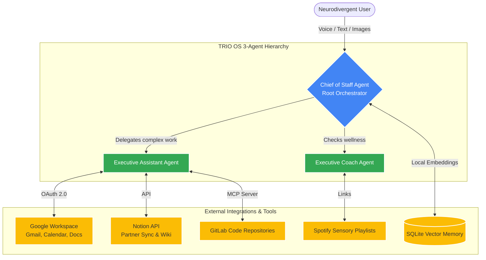

# ND TRIO Executive OS

## Overview

The ND TRIO Executive OS is a team of specialized AI agents designed as a "Cognitive Command Center" for neurodivergent (ADHD, Autism, Dyslexia) professionals. It assists users by providing deep workspace integration, pattern recognition, and wellness monitoring to combat executive dysfunction and burnout.

1. **Chief of Staff (CoS) Agent**: The orchestrator and primary communicator. This agent translates raw data into low-clutter, highly scannable Markdown. It possesses a "Pattern Recognition Engine" to cross-reference flooded email inboxes and calendar events, finding hidden connections and systemic trends. It delegates specialized tasks to sub-agents and uses long-term vector memory to learn user quirks.
2. **Executive Assistant (EA) Agent**: This agent is responsible for tactical operations and deep-work management. It connects to Google Workspace (Gmail, Calendar, Docs) and Notion to draft emails, read schedules, manage project wikis, and handle "Partner Delegated Tasks" (e.g., household chores added to a shared Notion page by a spouse). It also integrates with GitLab via MCP for code tracking.
3. **Executive Coach Agent**: This agent's role is to monitor emotional and cognitive wellness. It steps in during "Daily Check-Ins" to assess burnout, energy, and focus levels. It provides neuro-inclusive interventions, explicitly breaking ties between the other agents, and embeds live Lofi or Brown Noise Spotify playlists into the dashboard based on the user's real-time sensory needs.

### High-Level System Architecture



### 🏆 Hackathon Judging Criteria Alignment

*   **Technological Implementation**: Built on the **Google Agent Development Kit (ADK)** and Gemini, the system demonstrates extremely robust integration. It utilizes Google Workspace OAuth 2.0 (Gmail, Calendar, Docs), the Model Context Protocol (MCP) for secure GitLab access, the Notion API for "Second Brain" storage, and `sqlite-vec` for local vector memory. It also features autonomous Python background schedulers (`scheduler.py`) that run independently of the frontend.
*   **Design (UX/UI)**: The frontend is built in Streamlit using a custom "Glassmorphism" CSS theme. It is intentionally designed as a low-sensory, pastel-gradient UI to reduce cognitive load and sensory fatigue for neurodivergent users. It includes multi-modal inputs (voice memos, handwritten image uploads) so users don't have to type.
*   **Potential Impact**: Massive. Traditional productivity apps rely on the user to manually organize data, causing cognitive overload for those with ADHD. This system flips the paradigm: the agents autonomously manage the user's life (e.g., zero-data-entry LinkedIn Thought Leadership generation, partner body-doubling via Notion), directly addressing the core deficits of Executive Dysfunction.
*   **Quality of the Idea**: Highly creative. Instead of a generic coding assistant, this is a holistic *human support* network. Blending software engineering (GitLab) with cognitive wellness (Spotify sensory regulation) and household management (Notion partner integration) into a single, cohesive ADK agent topology is a deeply unique approach to AI assistants.

## Agent Details

The key features of the ND TRIO Executive OS include:

| Feature | Description |
| --- | --- |
| **Interaction Type** | Conversational & Multi-Modal (Voice/Image) |
| **Complexity**  | High |
| **Agent Type**  | Multi-Agent (Hierarchical) |
| **Components**  | Tools: Google Workspace, GitLab MCP, Notion, Spotify, SQLite Vector Memory |
| **Vertical**  | Productivity & Neuro-Inclusive Accessibility |

## Setup and Installation

1.  **Prerequisites**
    *   Python 3.10+
    *   Google Cloud Project (OAuth 2.0 Client ID credentials)
    *   GitLab Access Token
    *   Notion API Integration Token

2.  **Installation**
    ```bash
    # Clone this repository.
    git clone https://github.com/Ksridhar84/TRIO-ND-Executive-Agents.git
    cd TRIO-ND-Executive-Agents
    
    # Install dependencies
    pip install -r requirements.txt
    ```

3.  **Configuration**
    *   Create a `.env` file based on `.env.example`:
        ```bash
        GEMINI_API_KEY=<your-gemini-key>
        GITLAB_TOKEN=<your-gitlab-token>
        GITLAB_PROJECT_ID=<your-project-id>
        NOTION_API_TOKEN=<your-notion-token>
        ```
    *   Place your Google `credentials.json` in the root directory. Upon first run, you will be prompted to authenticate via your browser to generate a `token.json`.

## Running the Agent

You can run the interactive Streamlit dashboard locally:

```bash
streamlit run dashboard.py
```

This will start a local web server and open the Glassmorphism UI in your browser. From the sidebar, you can:
*   Submit a "Daily Coach Check-In" to trigger wellness protocols.
*   Upload Voice Memos or Images.
*   Manage persistent Chat History sessions.

Alternatively, the background scheduler runs automatically to deliver Morning Briefings and perform hourly Pattern Recognition scans on your inbox.

### Example Interaction

Below is an example interaction demonstrating the system's pattern recognition and integration capabilities:

```
User: CoS, please draft my LinkedIn posts for this week. Look at my recent calendar events and emails to see what consulting work I've actually been doing, and cross-reference that with the brand pillars listed in my 'LinkedIn Strategy' Notion page to write 3 engaging posts.

Chief of Staff: I am pulling your data now. I see from your calendar that you had three meetings this week regarding Google Cloud Architecture, and your emails show you successfully resolved a major data migration bottleneck for a client. 

I've also retrieved your "LinkedIn Strategy" from Notion, noting your focus on "Demystifying AI for Enterprise." 

Here are three drafted posts based on your real-world work:

[Post 1: Focuses on the hidden complexities of cloud data migration, tying it back to your recent client success...]
[Post 2: A thought leadership piece on enterprise AI adoption, pulling directly from your brand pillars...]
[Post 3: A breakdown of a technical hurdle you solved this week, framed as actionable advice for other engineers...]
```
